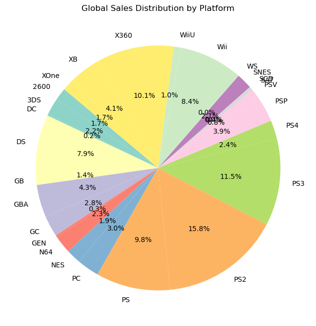
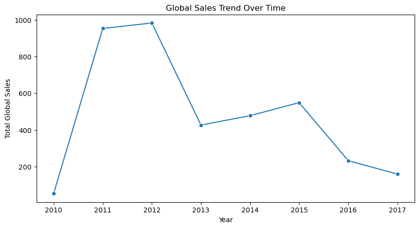
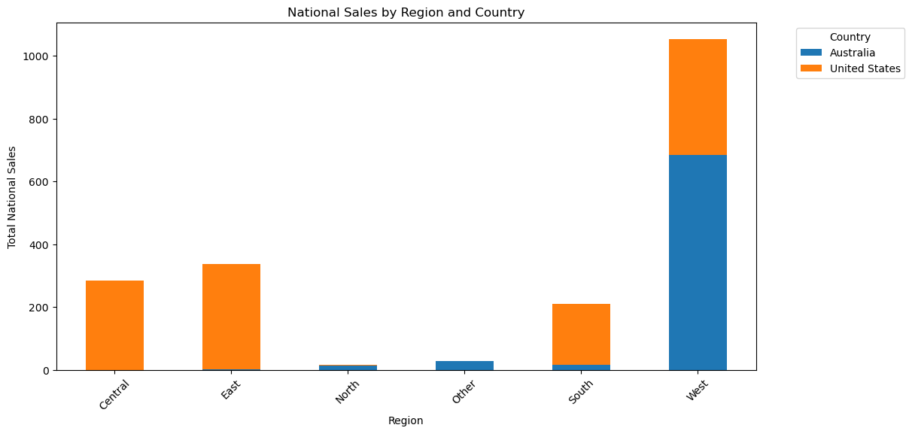
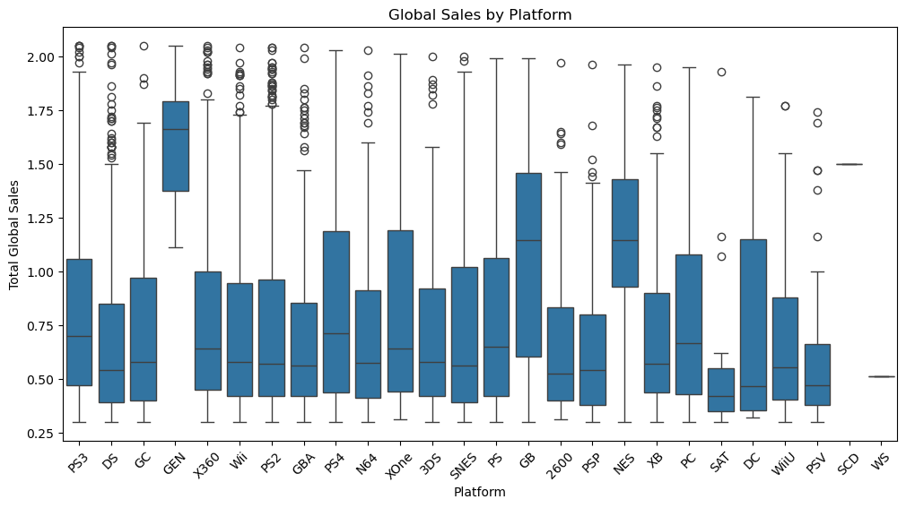

# Video-Games-Sales-Analysis

## **Overview**
This project analyzes video game sales trends using Python, Pandas, and Matplotlib.

## **Key Insights**
### **1️⃣ Global Sales Distribution by Platform**

### **2️⃣ Sales Trend Over Time**

### **3️⃣ National Sales by Region and Country**

### **4️⃣ Global Sales by Platform**

## 📂 **Files in this Repository**
- `sales_analysis.ipynb` → Jupyter Notebook with code.
- `pie_chart_sales.png` → Pie chart visualization.
- `line_chart_sales.png` → Line chart visualization.
- `bar_chart_sales.png` → Bar chart visualization.
- `box_plot_sales.png` → Box plot visualization.
